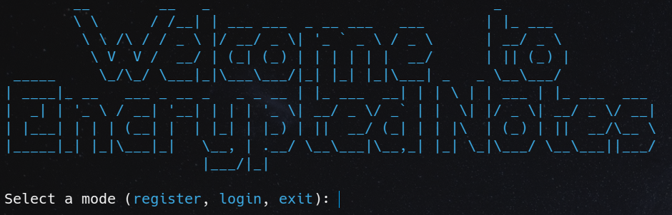

# Secure Notes Application



## Application Purpose
This console-based secure notes system allows multiple users to register, log in, and access their private, encrypted notes. Users can create, read, delete notes, and view their list of stored notes. The application incorporates symmetric and asymmetric encryption, two-factor authentication, and secure key generation. The internal structure includes the following modules:

- **UserManager**: Manages user registration and authentication.
- **CryptoUtils**: Provides cryptographic functions, such as salt generation and key derivation.
- **NoteHandler**: Allows users to create, read, list, and delete notes.
- **RSAUtils**: Manages RSA key generation and storage.
- **TwoFactorAuth**: Implements two-factor authentication (2FA) using TOTP.
- **PrintManager**: Manages console messages and debug logs.

## User Authentication
User authentication uses passwords and 2FA (Google Authenticator) to enhance security. The steps include:

- **Registration**: Generates a random salt and derives a key using PBKDF2-HMAC-SHA256 with 480,000 iterations. The salt and encrypted password token are stored in the `users.json` file.
- **Login**: For authentication, the application decrypts the token using the provided salt and password, also verifying the 2FA code via `pyotp`.
- **Algorithms Used**: PBKDF2-HMAC-SHA256 for key derivation, Fernet for symmetric password encryption, and TOTP for 2FA. Key derivation strengthens security by creating a secure, unique key for each user.

## Symmetric and Asymmetric Encryption
- **Symmetric Encryption Purpose**: Protect the content of the notes using ChaCha20Poly1305 for authenticated encryption.
- **Authenticated Encryption**: Each note’s content is encrypted with a encryption key generated by `ChaCha20Poly1305.generate_key()`. A nonce and additional authenticated data (AAD) are used to ensure data integrity.
- **encryption Key Encryption**: The encryption key is encrypted with the user’s RSA public key using OAEP-SHA256 padding. This ensures that only the user can decrypt the encryption key.
- **Key Management**: encryption keys are dynamically generated for each note and stored in encrypted form, while RSA keys are stored securely (in `users.json` and `.pem` files) to prevent unauthorized access.

## Message Authentication Codes (MAC)
- **MAC Purpose**: Ensures the integrity of notes and authenticity of keys.
- **Algorithm Used**: ChaCha20Poly1305, an authenticated encryption cipher that generates MAC tags. This cipher enables integrity and authenticity verification without the need for additional HMAC functions.
- **Key Management**: encryption keys generated for ChaCha20Poly1305 are encrypted and stored alongside notes, ensuring that only authenticated users can access note contents. This approach simplifies integrity and authenticity management within the encryption process.

## App Usage
1. Clone or download this repository:
    ```bash
    git clone git@github.com:lgandarillas/p1_cripto.git
    cd p1_cripto
    ```

2. Set up the virtual environment and install dependencies:
    ```bash
    python3 -m venv venv
    source venv/bin/activate
    pip install -r requirements.txt
    ```

3. Run the application:
    ```bash
    python src/main.py
    ```
